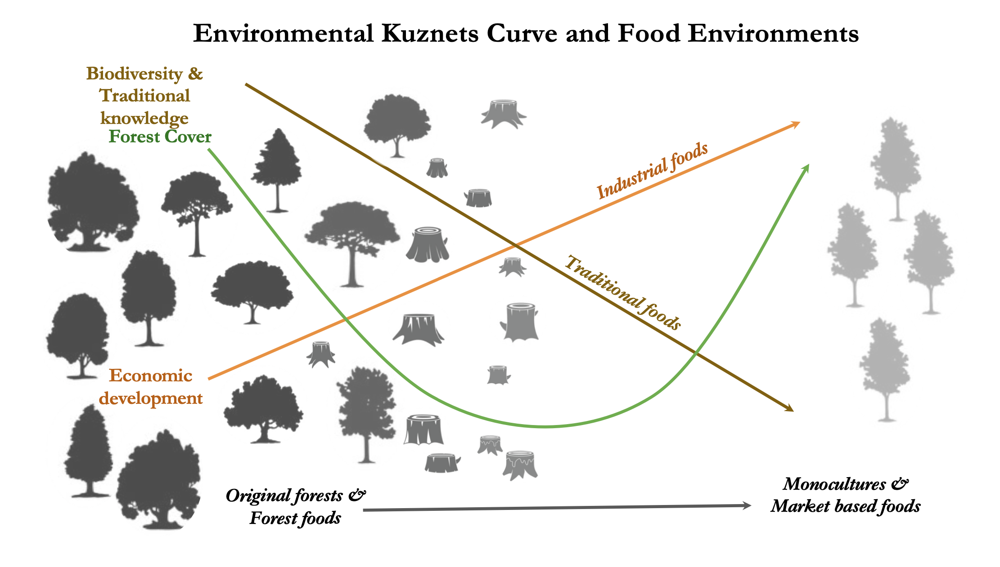
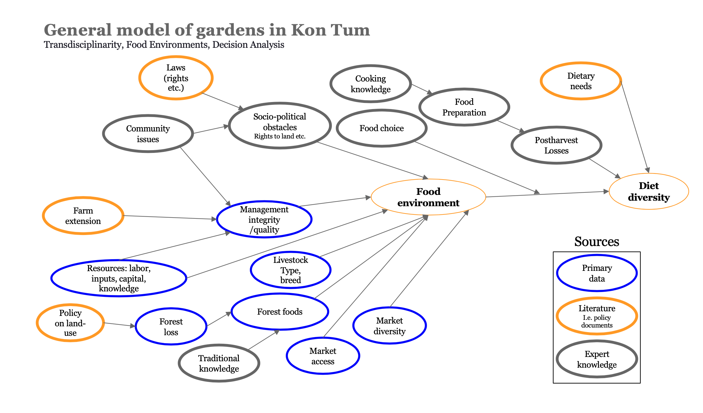
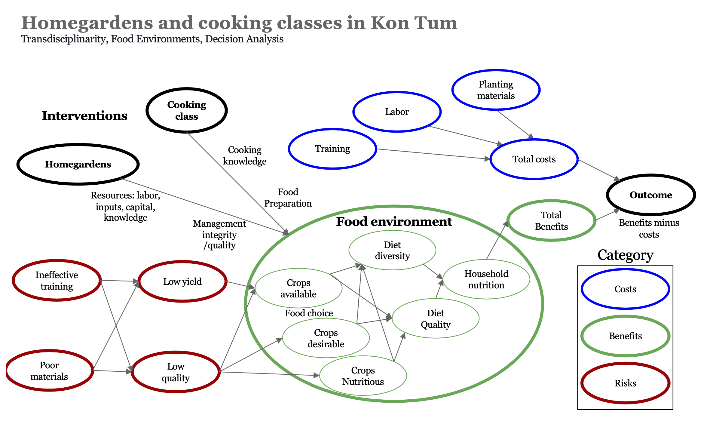

```{r setup, include=FALSE}
knitr::opts_chunk$set(echo = TRUE)

```

Here we model an intervention to address malnutrition among ethnic minority groups in Kon Tum, Vietnam. The model follows observations and discussions and some follow up work by partners of the NIFAM (Nutrition Intervention Forecasting and Monitoring) project in 2022 and 2023. The model focuses on the traditional diets of the Ca Dong people of Kon Tum, Vietnam. 

The food environments of the Ca Dong people have changed dramatically since they were resettled from ancestral lands for the construction of the Dak Drinh hydropower reservoir in 2013. Food environments have shifted from traditional hunting, wild harvesting, and swidden agriculture, to low-income commodity production, leading to a decline in forests and the loss of traditional food plants and animals. Through transdisciplinary approaches, we engaged eight groups of stakeholders including local party leaders and forest-dependent communities to explore options for supporting diverse and sustainable food environments. 
We applied participatory exploration of forest food availability and diversity. We model the potential of reforested areas to restore traditional food environment practices.

We assess policy-level land-use planning to understand the transitions from forests to farmlands and their implications for food environments and forest ecology. 



**Environmental Kuznets Curve and Food Environments**

Locally, food environments and forest cover follow an environmental Kuznets curve. The conversion of diverse forests to monoculture commodity production has resulted in a loss of ecological resources as well as traditional ecological knowledge and customarily governed forest harvests, affecting food choices and livelihoods. The future of these complex forest systems is unclear. The intertwined issues of forests, food environments, poverty, cultural preservation, and sustainable resource protection highlight the complex challenges faced by indigenous communities undergoing resettlement and changes in their food systems. 

Together we set out to identify and model possible solutions, including agroforestry interventions in productive zones. Homegarden agroforestry options could be practicable. These gardens could include plants and animal diversity and lead to better nutrition for households and communities. They could also preserve the traditional diets and customs of people who have been displaced or no longer have access to the forest. 


**Homegarden agroforestry options as an intervention to improve food environments in Kon Tum, Vietnam**

Our work aims to offer potentail ways of addressing these challenges. We set out to develop evidence-based solutions that balance economic development with ecological and cultural sustainability. By collaborating with local stakeholders and incorporating local ecological knowledge. We aim to support interventions for sustainable diets, biodiversity conservation, and livelihood security in the changing landscapes of Vietnam's highlands. 

We identified and described forest foods in community meetings, through observations and forest walks. The iNaturalist app was also used locally and taught to local people so that they could add to the list of edible forest species. 

A test run of the intervention was meant to be carried out by the Social Policy Ecology research Institute (SPERI) in Kon Tum with smallholder farmers of the Ca Dong ethnic minority group. The next phase of the work would have been to test selected species for nutrition and field sites for the potential of growing in homegardens. However, there was a local uprising of indigenous people nit far from our project location. Several people were shot and killed including local political leaders and local ethnic minority people. We were unable to continue our work and instead report on what we learned in this short communication. 


**Conceptual model of homegardens and cooking classes as an intervention to improve food environments in Kon Tum, Vietnam**

# Kon Tum garden and cooking class simulation

We use the `mcSimulation` function to perform a Monte Carlo simulations to estimate model outputs based on provided parameters and a model function. The Monte Carlo simulation generates a set of estimated model outputs based on random input samples, providing a distribution of potential outcomes.


```{r mcsimulation}
# Source our model
source("KonTum_Garden_Model.R")

# Ensure consistent results with the random number generator
# not for each 'run' of the MC simulation but for 
# consistency each time we call on the simulation 
set.seed(1234) 

garden_simulation_results <- mcSimulation(
  estimate = estimate_read_csv("inputs_kontum_garden.csv"),
  model_function = kontum_garden_function,
  numberOfModelRuns = 1000, #run 1000 times
  functionSyntax = "plainNames"
)
```

Here we present the value for the interventions as a Net Present Value (NPV). However, to be a realistic alternative, these interventions need to provide equivalent income to cassava planting (roughly 20 million VND per ha/yr). We have added a line to the plot to represent this cut off. 

```{r}
source("functions/plot_distributions.R")
plot_distributions(mcSimulation_object = garden_simulation_results, 
                                    vars = c("NPV_garden", "NPV_no_garden"),
                                    method = 'hist_simple_overlay', 
                                    base_size = 7, 
                                    x_axis_name = "Comparative NPV outcomes") + geom_vline(xintercept = 90)
```

## Net Present Value

We plot the distribution for the decision and frame the projected NPV gain for the 'decision' (distributions for the two options with the NPV values of the `no garden` option subtracted from those for the `garden`). 

```{r framing_NPV_results}
plot_distributions(mcSimulation_object = garden_simulation_results, 
                                    vars = "decision",
                                    method = 'hist_simple_overlay', 
                                    base_size = 7,  
                                    x_axis_name = "Relative gain compared to no garden") + geom_vline(xintercept = 90)

```

## Summary of results for the decision

We use `gt_plt_summary()` from {gtExtras} to plot the results for all the outputs of our simulation. 

```{r gtExtras_summary}
library(gtExtras)
library(svglite)
# Subset the outputs from the mcSimulation function (y) to summarize only on the variables that we want.
mcSimulation_summary <- data.frame(garden_simulation_results$x[2:38], 
                                 garden_simulation_results$y[1:3])

gt_plt_summary(mcSimulation_summary) 
```

Summary of the savings

```{r summary_decision}
summary(garden_simulation_results$y$decision)
```

Summary of costs

```{r summary_costs}
summary(garden_simulation_results$y$total_costs)
```

# Summary of the first year of investment

```{r summary_first_year_costs}
summary(garden_simulation_results$y$Cashflow_garden1)
```

# Cashflow of the garden option

```{r}
source("functions/plot_cashflow.R")
plot_cashflow(mcSimulation_object = garden_simulation_results, 
              cashflow_var_name = "Cashflow_garden")
```

# EVPI

```{r}
# Subset the outputs from the mcSimulation function (y) by selecting the correct variables be sure to run the multi_EVPI only on the variables that the we want.
mcSimulation_table <- data.frame(garden_simulation_results$x, 
                                 garden_simulation_results$y[1:3])
source("functions/multi_EVPI.R")
evpi <- multi_EVPI(mc = mcSimulation_table, first_out_var = "NPV_garden")

source("functions/plot_evpi.R")
plot_evpi(evpi, decision_vars = "decision")
```

# Projection to Latent Structure

Here we run a Projection to Latent Structures (PLS) model, a flexible type of regression model. The results of this model can give us some sense of the correlation strength and direction for model variables and our outcome variables.

```{r}
source("functions/pls_model.R")
pls_result <- pls_model(object = garden_simulation_results,
                                resultName = names(garden_simulation_results$y)[1], 
                                ncomp = 1)

input_table <- read.csv("inputs_kontum_garden.csv")
source("functions/plot_pls.R")
plot_pls(pls_result, input_table = input_table, threshold = 0)
```

The full repository can be accessed with the following QR code.

